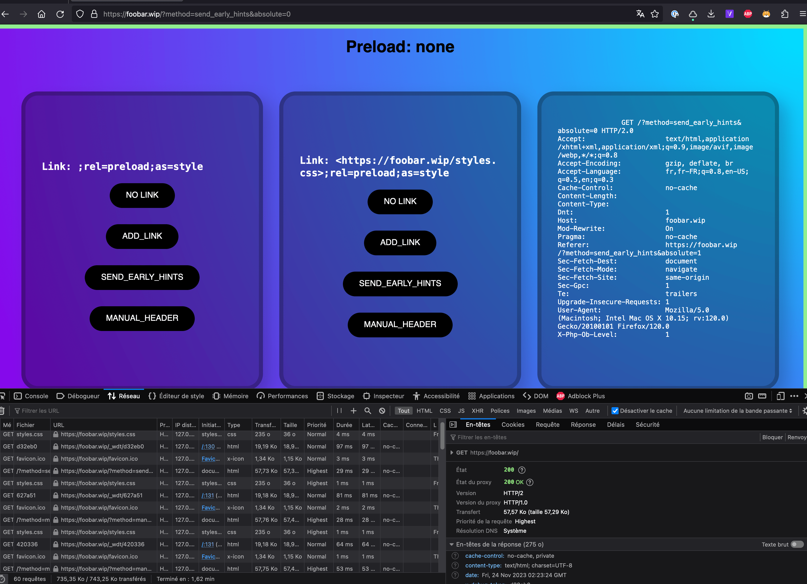

# Bug Firefox / WebLink ?

It seems that Firefox does not support root-relative links in the `href` attribute of the `link` element. 

This could be a problem as the ImportMap generates such Links during the ImportMap generation.

I still do feel that there is something related to the Symfony proxy (captures added in the issue).


## Reproduce

```
composer install

symfony server:start -d
```



Open this page with Firefox. As long as you click on the center buttons, everything is fine. 

But if you click on the left buttons (relative URLs), you will be stuck in a network total freeze.

With Safari & Chrome, everything is fine to me.
